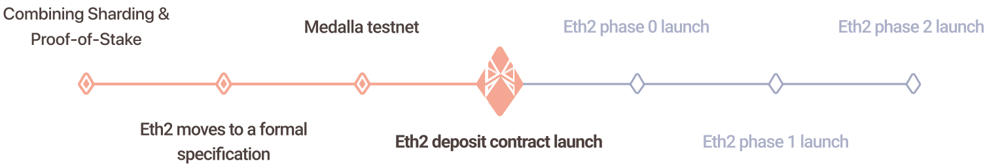

# Migration Schedule

## Ethereum 2.0 Migration Schedule

ETH2 will be released in several phases.

Phase 0 contains all of the machinery behind ETH2's PoS consensus, it tracks the validators and their balances.

Phase 1 handles adding, storing, and retrieving the data associated with ETH2's shards.

Phase 1.5 updates Ethereum as we know it today from PoW to PoS by making it a shard under 2. 

Phase 2 adds execution to the remaining ETH2 shards which enables smart contracts to run on all of the shards.

### The Beacon Chain

[Beacon Chain](https://ethereum.org/en/eth2/beacon-chain/) is known as phase 0 in the roadmap. The beacon chain doesn't change anything about the Ethereum we use today. It will coordinate the network, and introduces proof-of-stake to the Ethereum ecosystem.

This is estimated to deliver in Dec 01, 2020.

### Shard Chains

[Shard Chains](https://ethereum.org/en/eth2/shard-chains/) is included in phase 1 and phase 2. Sharding is a multi-phase upgrade to improve Ethereum’s scalability and capacity. Shard chains spread the network's load across 64 new chains. They make it easier to run a node by keeping hardware requirements low.

This is estimated to deliver in 2021.

### The Docking

[Docking mainnet with ETH2](https://ethereum.org/en/eth2/docking/) is known as phase 1.5 in the roadmap. Eventually the current Ethereum mainnet will "dock" with the rest of the ETH2 upgrades. The docking will merge "ETH1" mainnet with the ETH2 beacon chain and sharding system. This will mark the end of proof-of-work for Ethereum, and the full transition to proof of stake.

This is estimated to deliver in 2022.

## C.R.E.A.M. to Ethereum 2.0 Schedule

### Conservative Migration

For the safety of the protocol, the migration process will be done conservatively.

We will not deposit a large batch to [ETH2 deposit contract](https://etherscan.io/address/0x00000000219ab540356cbb839cbe05303d7705fa). Once we verify that the whole mechanism is stable and robust after phase 0 kicks off, we will continuously deposit to ETH2 contract.

However, full plan is hard to reveal at the moment, for other than stable and safety there are still factors affecting our implementation like reward model and APR. The effect of these factors are dynamically changing and we will find the way to balance and optimize them all.

### Transactions

| Number | ETH  | Transaction Address |
| :--- | :--- | :--- |
| 0 | 32 | [0xee65019cfd98cd7c70d1fafb7ddf16692d8d5d4b9a6d308c55d4109d3671cf32](https://etherscan.io/tx/0xee65019cfd98cd7c70d1fafb7ddf16692d8d5d4b9a6d308c55d4109d3671cf32) |
| 1 ~ 19 | 608 | [0xf8516ee875af706f4fb59627e33d1258780521502d96888226c5b5af219ac1bc](https://etherscan.io/tx/0xf8516ee875af706f4fb59627e33d1258780521502d96888226c5b5af219ac1bc) |
| 20 ~ 119 | 3,200 | [0xed3859672bc9a40ae6588ad85e4e426c0bcc8b90a46fe929a041c32a894b46e1](https://etherscan.io/tx/0xed3859672bc9a40ae6588ad85e4e426c0bcc8b90a46fe929a041c32a894b46e1) |
| 120 ~ 149 | 960 | [0x60c51dd40578a71981da88674894e5330c5bcf0fc825d2e0692030414e375dc6](https://etherscan.io/tx/0x60c51dd40578a71981da88674894e5330c5bcf0fc825d2e0692030414e375dc6) |
| 150 ~ 249 | 3,200 | [0x0d4f41b1a23a383dd2aeb9ce66f00467196a3f5ac3c09b90d674f4ca2e964d7d](https://etherscan.io/tx/0x0d4f41b1a23a383dd2aeb9ce66f00467196a3f5ac3c09b90d674f4ca2e964d7d) |
| 250 ~ 349 | 3,200 | [0x712d549398bc116dd618e3ad0da26599e8bba3632a029a8443cc338d297a69b9](https://etherscan.io/tx/0x712d549398bc116dd618e3ad0da26599e8bba3632a029a8443cc338d297a69b9) |
| 350 ~ 449 | 3,200 | [0xd0f7f9889efa7fb6aca7f3c5c8c5bbc2fbbdbd4154c096755f21470e6c7ce3ee](https://etherscan.io/tx/0xd0f7f9889efa7fb6aca7f3c5c8c5bbc2fbbdbd4154c096755f21470e6c7ce3ee) |
| 450 ~ 499 | 1,600 | [0xddfd735cb8f0ed15fc360b6e02ff5483639490c4657f2422fb2eaae1f73ab088](https://etherscan.io/tx/0xddfd735cb8f0ed15fc360b6e02ff5483639490c4657f2422fb2eaae1f73ab088) |
| 500 ~ 529 | 960  | [https://etherscan.io/tx/0x39d906b37c5be86199637f8d324834ac69fe82921dc6d20e62f306334413db81](https://etherscan.io/tx/0x39d906b37c5be86199637f8d324834ac69fe82921dc6d20e62f306334413db81) |

