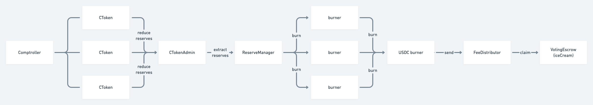
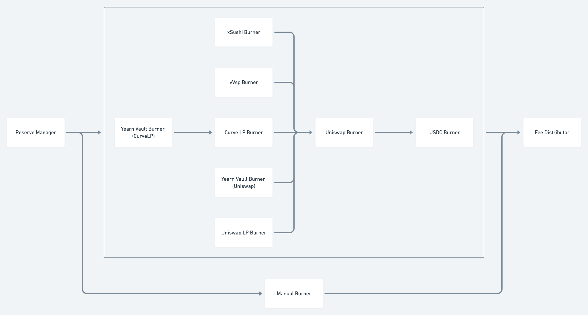

# iceCREAM Mechanism Phase 1

## Components

### Lending Protocol

The lending protocol includes the comptroller, cToken markets, and cTokenAdmin. Every market will generate reserves. CTokenAdmin is a new contract that controls the cToken market. In addition to normal access control in cToken, it allows a specific reserve manager to extract reserves.

Source: [https://github.com/CreamFi/compound-protocol](https://github.com/CreamFi/compound-protocol)

### Reserve Manager

The reserve manager is the hub of reserves extraction. It snapshots all the cToken reserves and everyone could trigger the extraction \(with a 1-day cooldown period\). It should take a ratio \(currently 50%\) of reserves and send them to the burners.

Source: [https://github.com/CreamFi/reserve-manager](https://github.com/CreamFi/reserve-manager)

### Burners

Burners are a group of token converters. They will burn tokens into USDC, and USDC burner will convert USDC into yvCurve-IB token. There is a special component called manual burner. It's used for tokens whose onchain liquidity \(Ethereum\) is not deep enough. The manual burner is an EOA that will send the tokens to a centralized exchange or another network to convert manually. In the end, all tokens will be converted to yvCurve-IB token and send to the fee distributor.

Source: [https://github.com/CreamFi/curve-dao-contracts](https://github.com/CreamFi/curve-dao-contracts)

### Fee Distributor & Voting Escrow

The fee distributor and the voting escrow are the final stops of iceCream phase 1. The fee distributor stores all the reserves in yvCurve-IB and it handles the fee distribution among all the iceCream stakers. The voting escrow \(iceCream\) is where users stake their CREAM tokens. Users could claim the rewards here.

Source: [https://github.com/CreamFi/curve-dao-contracts](https://github.com/CreamFi/curve-dao-contracts)

