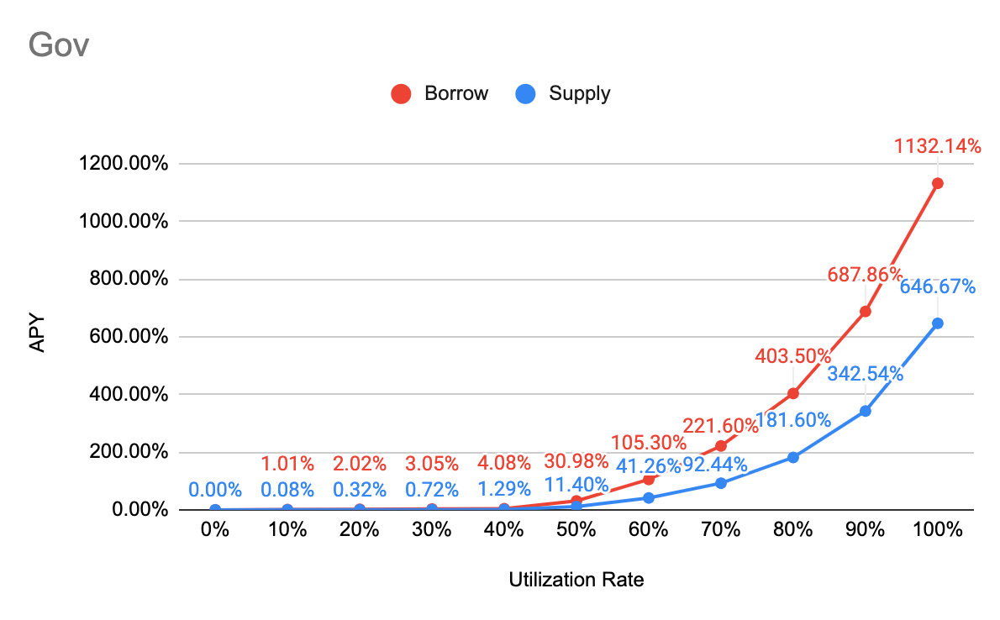

# Interest Rate Model

### APY Function

**Borrow APY**

= \[1 + Base + Multiplier \* min\(UtilizationRate, Kink\) + max\(JumpMultiplier \* UtilizationRate - Kink, 0\)\] ^ 2102400 - 1

**Supply APY**

= Distribute \(Interest Paid by Borrowers Per Block - Reserve\) to all suppliers, and convert it into APY

= Distribute \[\(1 + Borrow APY\) ^ \(1 / BlocksPerYear\) - 1\] \* Total Borrow \* \(1 - Reserve Factor\) to all suppliers, and convert it into APY

= {\[\(1 + Borrow APY\) ^ \(1 / BlocksPerYear\) - 1\] \* Total Borrow \* \(1 - Reserve Factor\) / Total Supply}, and convert it into APY

= {1 + \[\(1 + Borrow APY\) ^ \(1 / BlocksPerYear\) - 1\] \* Total Borrow \* \(1 - Reserve Factor\) / Total Supply} ^ BlocksPerYear - 1

= **{1+\[\(1+Borrow APY\)^\(1/BlocksPerYear\)-1\]\*\(1-Reserve Factor\)\*Utilization Rate}^BlocksPerYear-1**


BlocksPerYear = 2,102,400 \(15 sec per block\)



Find other variables in [Markets](https://app.cream.finance/markets)


### Major

| Parameter | Value |
| :--- | :--- |
| Tokens | WETH, WBTC |
| Base | 0% |
| Multiplier | 17.5% |
| JumpMultiplier | 200% |
| Kink 1 | 80% |
| Kink 2 | 90% |
| Contract Address | [0x61e9a6aB4923F5046C0Fb80E5c9F98afc9995fad](https://etherscan.io/address/0x61e9a6ab4923f5046c0fb80e5c9f98afc9995fad#code) |

### Stable

| Parameter | Value |
| :--- | :--- |
| Tokens | y3Crv, DAI, USDT, USDC, sUSD, mUSD, DUSD, EURS, sEUR, BUSD, GUSD, cDAI, cUSDT, cUSDC |
| Base | 0% |
| Multiplier | 13% |
| JumpMultiplier | 800% |
| Kink 1 | 80% |
| Kink 2 | 90% |
| Contract Address | [0xd6C04cF463A52A9C929D434F9F84ee70c1c0Ac6F](https://etherscan.io/address/0xd6C04cF463A52A9C929D434F9F84ee70c1c0Ac6F#code) |

### Governance

| Parameter | Value |
| :--- | :--- |
| Tokens | LINK, YFI, SNX, DPI |
| Base | 0% |
| Multiplier | 10% |
| JumpMultiplier | 450% |
| Kink | 45% |
| Contract Address | [0xaaeDaFC0a2550c8D25A881904b85d91931bA6992](https://etherscan.io/address/0xaaedafc0a2550c8d25a881904b85d91931ba6992) |

