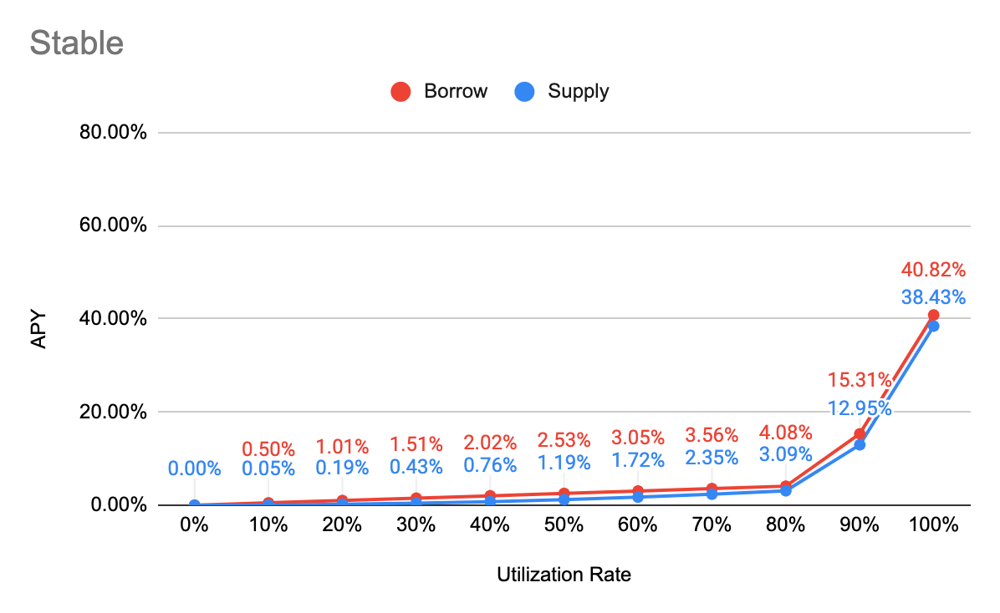
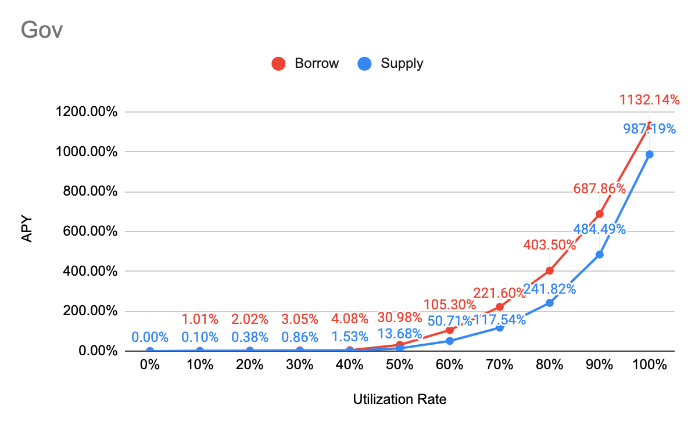

# Interest Rate Model

### APY Function

Borrow APY

= Base + min\(Multiplier \* __UtilizationRate, Multiplier \* Kink\) + max\(JumpMultiplier \* UtilizationRate - Kink, 0\)

Supply APY

= annualized\[de–annualized\(Borrow APY\) - Reserve Factor\]

### Major

| Parameter | Value |
| :--- | :--- |
| Tokens | WETH, WBTC |
| Base | 2% |
| Multiplier | 20% |
| JumpMultiplier | 60% |
| Kink | 70% |
| Contract Address | [0xb84AD7455adAB0C56146E560F9069a9148CEbaac](https://etherscan.io/address/0xb84AD7455adAB0C56146E560F9069a9148CEbaac) |

### Stable

| Parameter | Value |
| :--- | :--- |
| Tokens | y3Crv, DAI, USDT, USDC, sUSD, mUSD, DUSD, EURS, sEUR, BUSD, GUSD, cDAI, cUSDT, cUSDC |
| Base | 0% |
| Multiplier | 5% |
| JumpMultiplier | 200% |
| Kink | 85% |
| Contract Address | [0x990f82875664bc6Eb0E1e8e825ec0f91757e8047](https://etherscan.io/address/0x990f82875664bc6eb0e1e8e825ec0f91757e8047) |

### Governance

| Parameter | Value |
| :--- | :--- |
| Tokens | LINK, YFI, SNX, DPI |
| Base | 0% |
| Multiplier | 10% |
| JumpMultiplier | 450% |
| Kink | 45% |
| Contract Address | [0xaaeDaFC0a2550c8D25A881904b85d91931bA6992](https://etherscan.io/address/0xaaedafc0a2550c8d25a881904b85d91931ba6992) |

