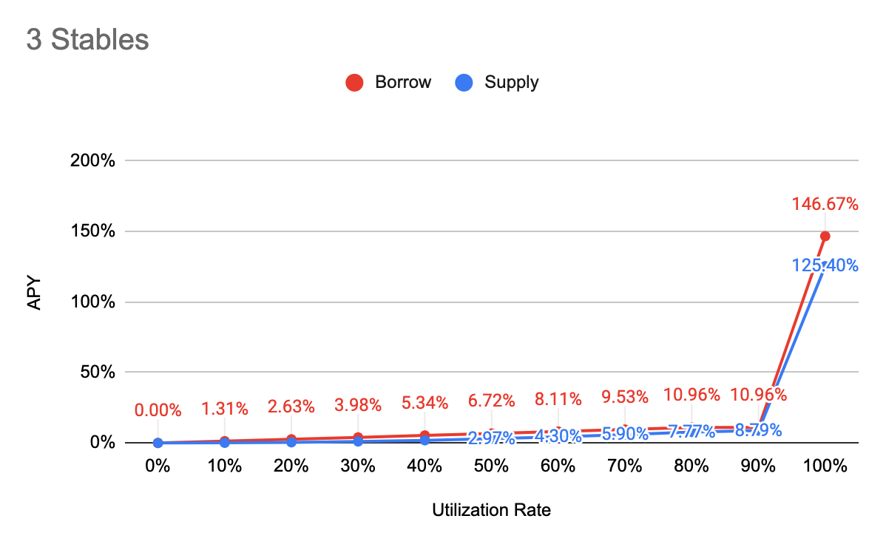

# Interest Rate Model

### APY Function

**Borrow APY**

= \[1 + Base + Multiplier \* min\(UtilizationRate, Kink1\) + max\(JumpMultiplier \* UtilizationRate - Kink2, 0\)\] ^ 2102400 - 1

**Supply APY**

= Distribute \(Interest Paid by Borrowers Per Block - Reserve\) to all suppliers, and convert it into APY

= Distribute \[\(1 + Borrow APY\) ^ \(1 / BlocksPerYear\) - 1\] \* Total Borrow \* \(1 - Reserve Factor\) to all suppliers, and convert it into APY

= {\[\(1 + Borrow APY\) ^ \(1 / BlocksPerYear\) - 1\] \* Total Borrow \* \(1 - Reserve Factor\) / Total Supply}, and convert it into APY

= {1 + \[\(1 + Borrow APY\) ^ \(1 / BlocksPerYear\) - 1\] \* Total Borrow \* \(1 - Reserve Factor\) / Total Supply} ^ BlocksPerYear - 1

= **{1+\[\(1+Borrow APY\)^\(1/BlocksPerYear\)-1\]\*\(1-Reserve Factor\)\*Utilization Rate}^BlocksPerYear-1**


BlocksPerYear = 2,102,400 \(15 sec per block\)



Find other variables in [Markets](https://app.cream.finance/markets/ironbank)


### Major

| Parameter | Value |
| :--- | :--- |
| Tokens | WETH, WBTC |
| Base | 0% |
| Multiplier | 17.5% |
| JumpMultiplier | 200% |
| Kink 1 | 80% |
| Kink 2 | 90% |
| Contract Address | [0x61e9a6aB4923F5046C0Fb80E5c9F98afc9995fad](https://etherscan.io/address/0x61e9a6ab4923f5046c0fb80e5c9f98afc9995fad#code) |

### Stable

<table>
  <thead>
    <tr>
      <th style="text-align:left">Parameter</th>
      <th style="text-align:left">Value</th>
    </tr>
  </thead>
  <tbody>
    <tr>
      <td style="text-align:left">Tokens</td>
      <td style="text-align:left">y3Crv, sUSD, mUSD, DUSD, EURS, sEUR, BUSD, GUSD, cDAI, cUSDT, cUSDC, USDP,
        FRAX, EUR, EURt, KRW, JPY, AUD, GBP, CHF</td>
    </tr>
    <tr>
      <td style="text-align:left">Base</td>
      <td style="text-align:left">0%</td>
    </tr>
    <tr>
      <td style="text-align:left">Multiplier</td>
      <td style="text-align:left">13%</td>
    </tr>
    <tr>
      <td style="text-align:left">JumpMultiplier</td>
      <td style="text-align:left">800%</td>
    </tr>
    <tr>
      <td style="text-align:left">Kink 1</td>
      <td style="text-align:left">80%</td>
    </tr>
    <tr>
      <td style="text-align:left">Kink 2</td>
      <td style="text-align:left">90%</td>
    </tr>
    <tr>
      <td style="text-align:left">Contract Address</td>
      <td style="text-align:left">
        
<a href="https://etherscan.io/address/0xd6C04cF463A52A9C929D434F9F84ee70c1c0Ac6F#code">0xd6C04cF463A52A9C929D434F9F84ee70c1c0Ac6F</a>
        

        
<a href="https://etherscan.io/address/0x26c325C8880FfE5a5744fF667ba7D8651B868710">0x26c325C8880FfE5a5744fF667ba7D8651B868710</a>
        

      </td>
    </tr>
  </tbody>
</table>

### 3 Stables

| Parameter | Value |
| :--- | :--- |
| Tokens | DAI, USDC, USDT |
| Base | 0% |
| Multiplier | 13% |
| JumpMultiplier | 800% |
| Kink 1 | 80% |
| Kink 2 | 90% |
| Contract Address | [0x1B0c2586Df3daAd42aC2FDCaA0f6B91623747556](https://etherscan.io/address/0x1B0c2586Df3daAd42aC2FDCaA0f6B91623747556) |

### Governance

| Parameter | Value |
| :--- | :--- |
| Tokens | LINK, YFI, SNX, DPI, UNI, SUSHI |
| Base | 0% |
| Multiplier | 27% |
| JumpMultiplier | 900% |
| Kink 1 | 80% |
| Kink 2 | 90% |
| Contract Address | [0xD369E8eaa0d2665Dfea6eb51fF2ADFca4EAA7891](https://etherscan.io/address/0xD369E8eaa0d2665Dfea6eb51fF2ADFca4EAA7891) |

