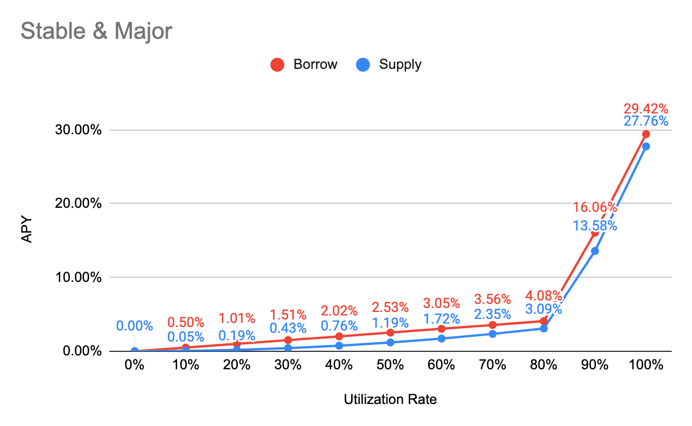

# Iron Bank

### Yearn Token \(cyToken\)

| Contract | Address | Collateral Factor | Reserve Factor |
| :--- | :--- | :--- | :--- |
| cyWETH | [0x41c84c0e2EE0b740Cf0d31F63f3B6F627DC6b393](https://etherscan.io/address/0x41c84c0e2ee0b740cf0d31f63f3b6f627dc6b393) | 85% | 5% |
| cyDAI | [0x8e595470Ed749b85C6F7669de83EAe304C2ec68F](https://etherscan.io/address/0x8e595470ed749b85c6f7669de83eae304c2ec68f) | 90% | 5% |
| cyY3CRV | [0x7589C9E17BCFcE1Ccaa1f921196FDa177F0207Fc](https://etherscan.io/address/0x7589c9e17bcfce1ccaa1f921196fda177f0207fc) | 90% | 5% |
| cyLINK | [0xE7BFf2Da8A2f619c2586FB83938Fa56CE803aA16](https://etherscan.io/address/0xe7bff2da8a2f619c2586fb83938fa56ce803aa16) | 0% | 5% |
| cyYFI | [0xFa3472f7319477c9bFEcdD66E4B948569E7621b9](https://etherscan.io/address/0xfa3472f7319477c9bfecdd66e4b948569e7621b9) | 0% | 5% |
| cySNX | [0x12A9cC33A980DAa74E00cc2d1A0E74C57A93d12C](https://etherscan.io/address/0x12a9cc33a980daa74e00cc2d1a0e74c57a93d12c) | 0% | 5% |
| cyWBTC | [0x8Fc8BFD80d6A9F17Fb98A373023d72531792B431](https://etherscan.io/address/0x8fc8bfd80d6a9f17fb98a373023d72531792b431) | 0% | 5% |
| cyUSDT | [0x48759F220ED983dB51fA7A8C0D2AAb8f3ce4166a](https://etherscan.io/address/0x48759f220ed983db51fa7a8c0d2aab8f3ce4166a) | 0% | 5% |
| cyUSDC | [0x76Eb2FE28b36B3ee97F3Adae0C69606eeDB2A37c](https://etherscan.io/address/0x76eb2fe28b36b3ee97f3adae0c69606eedb2a37c) | 0% | 5% |
| cySUSD | [0x4e3a36A633f63aee0aB57b5054EC78867CB3C0b8](https://etherscan.io/address/0x4e3a36a633f63aee0ab57b5054ec78867cb3c0b8) | 0% | 5% |
| cyMUSD | [0xBE86e8918DFc7d3Cb10d295fc220F941A1470C5c](https://etherscan.io/address/0xbe86e8918dfc7d3cb10d295fc220f941a1470c5c) | 0% | 5% |
| cyDUSD | [0x297d4Da727fbC629252845E96538FC46167e453A](https://etherscan.io/address/0x297d4da727fbc629252845e96538fc46167e453a) | 0% | 5% |
| cyEURS | [0xA8caeA564811af0e92b1E044f3eDd18Fa9a73E4F](https://etherscan.io/address/0xa8caea564811af0e92b1e044f3edd18fa9a73e4f) | 0% | 5% |
| cySEUR | [0xCA55F9C4E77f7B8524178583b0f7c798De17fD54](https://etherscan.io/address/0xca55f9c4e77f7b8524178583b0f7c798de17fd54) | 0% | 5% |

### Protocol Address

| Contract | Address |
| :--- | :--- |
| Comptroller | [0xAB1c342C7bf5Ec5F02ADEA1c2270670bCa144CbB](https://etherscan.io/address/0xab1c342c7bf5ec5f02adea1c2270670bca144cbb) |
| Comptroller Implementation | [0xb4CF50E2e7DC2ee44890ce5214718a9Bb538F957](https://etherscan.io/address/0xb4cf50e2e7dc2ee44890ce5214718a9bb538f957) |
| Price Oracle | [0xE4C1E5d96360847De7DFF72D2bD1c4B3d4284E97](https://etherscan.io/address/0xe4c1e5d96360847de7dff72d2bd1c4b3d4284e97) |

### Interest Rate Model

#### Stable & Major

| Parameter | Value |
| :--- | :--- |
| Tokens | WETH, DAI, Y3CRV, USDT, USDC, sUSD, mUSD, DUSD, WBTC, EURS, sEUR |
| Base | 0% |
| Multiplier | 5% |
| JumpMultiplier | 109% |
| Kink | 80% |
| Contract Address | ​[0xb84AD7455adAB0C56146E560F9069a9148CEbaac](https://etherscan.io/address/0xb84AD7455adAB0C56146E560F9069a9148CEbaac) |

#### Governance & Seeds

| Parameter | Value |
| :--- | :--- |
| Tokens | LINK, YFI, SNX |
| Base | 0% |
| Multiplier | 10% |
| JumpMultiplier | 140% |
| Kink | 80% |
| Contract Address | [0xd34137FC9F6754bcDFCe907d06F4D10E897B3eB5](https://etherscan.io/address/0xd34137FC9F6754bcDFCe907d06F4D10E897B3eB5) |

