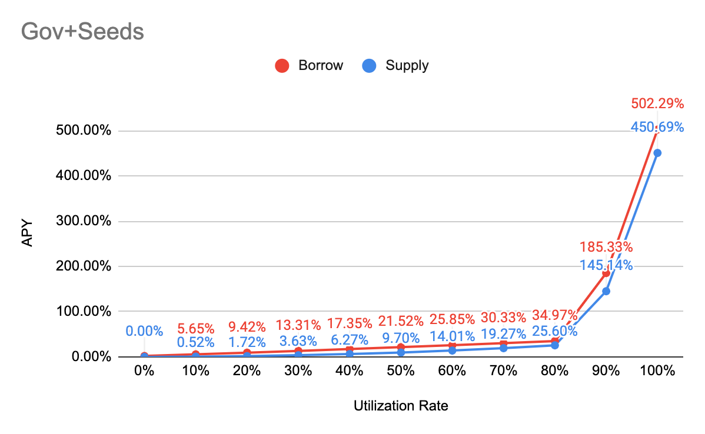

# Iron Bank

### cyToken Address

| Contract | Address |
| :--- | :--- |
| cyWETH | [0x41c84c0e2EE0b740Cf0d31F63f3B6F627DC6b393](https://etherscan.io/address/0x41c84c0e2ee0b740cf0d31f63f3b6f627dc6b393) |
| cyDAI | [0x8e595470Ed749b85C6F7669de83EAe304C2ec68F](https://etherscan.io/address/0x8e595470ed749b85c6f7669de83eae304c2ec68f) |
| cyY3CRV | [0x7589C9E17BCFcE1Ccaa1f921196FDa177F0207Fc](https://etherscan.io/address/0x7589c9e17bcfce1ccaa1f921196fda177f0207fc) |
| cyLINK | [0xE7BFf2Da8A2f619c2586FB83938Fa56CE803aA16](https://etherscan.io/address/0xe7bff2da8a2f619c2586fb83938fa56ce803aa16) |
| cyYFI | [0xFa3472f7319477c9bFEcdD66E4B948569E7621b9](https://etherscan.io/address/0xfa3472f7319477c9bfecdd66e4b948569e7621b9) |
| cySNX | [0x12A9cC33A980DAa74E00cc2d1A0E74C57A93d12C](https://etherscan.io/address/0x12a9cc33a980daa74e00cc2d1a0e74c57a93d12c) |
| cyWBTC | [0x8Fc8BFD80d6A9F17Fb98A373023d72531792B431](https://etherscan.io/address/0x8fc8bfd80d6a9f17fb98a373023d72531792b431) |

### Protocol Address

| Contract | Address |
| :--- | :--- |
| Comptroller | [0xAB1c342C7bf5Ec5F02ADEA1c2270670bCa144CbB](https://etherscan.io/address/0xab1c342c7bf5ec5f02adea1c2270670bca144cbb) |
| Comptroller Implementation | [0xb4CF50E2e7DC2ee44890ce5214718a9Bb538F957](https://etherscan.io/address/0xb4cf50e2e7dc2ee44890ce5214718a9bb538f957) |
| Price Oracle | [0xE4C1E5d96360847De7DFF72D2bD1c4B3d4284E97](https://etherscan.io/address/0xe4c1e5d96360847de7dff72d2bd1c4b3d4284e97) |

### Collateral Factor & Reserve Factor

| Contract | Collateral | Reserve |
| :--- | :--- | :--- |
| WETH | 85% | 0% |
| DAI | 90% | 0% |
| Y3CRV | 90% | 0% |
| LINK | 0% | 0% |
| YFI | 0% | 0% |
| SNX | 0% | 0% |
| WBTC | 0% | 0% |

### Interest Rate Model

| Parameter | Value |
| :--- | :--- |
| Tokens | WETH, DAI, Y3CRV |
| Base | 0% |
| Multiplier | 5% |
| JumpMultiplier | 109% |
| Kink | 80% |
| Contract Address | ​[0xb84AD7455adAB0C56146E560F9069a9148CEbaac](https://etherscan.io/address/0xb84AD7455adAB0C56146E560F9069a9148CEbaac) |

| Parameter | Value |
| :--- | :--- |
| Tokens | LINK, YFI, SNX, WBTC |
| Base | 0% |
| Multiplier | 10% |
| JumpMultiplier | 140% |
| Kink | 70% |
| Contract Address | [0xd34137FC9F6754bcDFCe907d06F4D10E897B3eB5](https://etherscan.io/address/0xd34137FC9F6754bcDFCe907d06F4D10E897B3eB5) |

