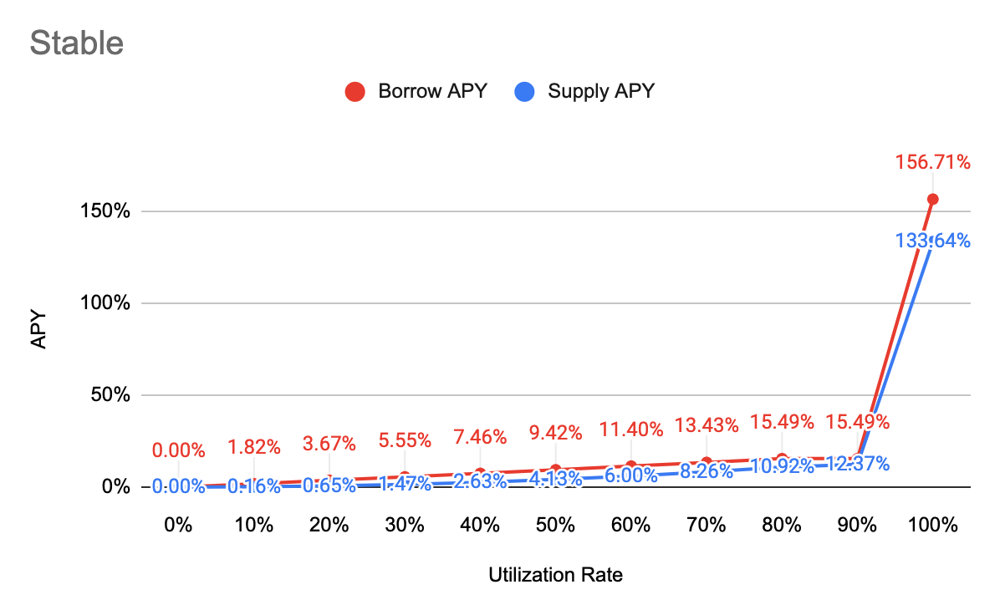
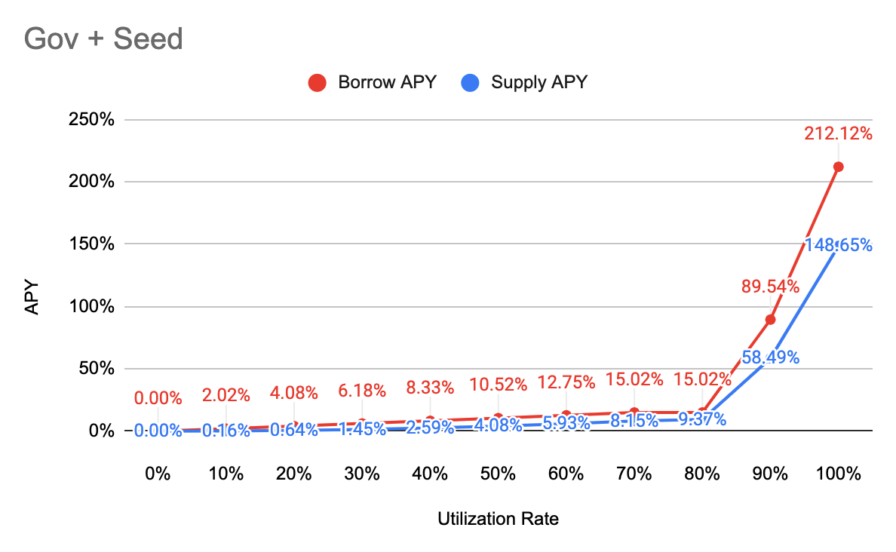

# Interest Rate Model

## APY Function

**Borrow APY**

= \[1 + Base + Multiplier \* min\(UtilizationRate, Kink\) + max\(JumpMultiplier \* UtilizationRate - Kink, 0\)\] ^ 2102400 - 1

**Supply APY**

= Distribute \(Interest Paid by Borrowers Per Block - Reserve\) to all suppliers, and convert it into APY

= Distribute \[\(1 + Borrow APY\) ^ \(1 / BlocksPerYear\) - 1\] \* Total Borrow \* \(1 - Reserve Factor\) to all suppliers, and convert it into APY

= {\[\(1 + Borrow APY\) ^ \(1 / BlocksPerYear\) - 1\] \* Total Borrow \* \(1 - Reserve Factor\) / Total Supply}, and convert it into APY

= {1 + \[\(1 + Borrow APY\) ^ \(1 / BlocksPerYear\) - 1\] \* Total Borrow \* \(1 - Reserve Factor\) / Total Supply} ^ BlocksPerYear - 1

= **{1+\[\(1+Borrow APY\)^\(1/BlocksPerYear\)-1\]\*\(1-Reserve Factor\)\*Utilization Rate}^BlocksPerYear-1**


BlocksPerYear = 2,102,400 \(15 sec per block\)



Find other variables in [Markets](https://app.cream.finance/markets/v1)


## Major

<table>
  <thead>
    <tr>
      <th style="text-align:left">Parameter</th>
      <th style="text-align:left">Value</th>
    </tr>
  </thead>
  <tbody>
    <tr>
      <td style="text-align:left">Category</td>
      <td style="text-align:left">Major</td>
    </tr>
    <tr>
      <td style="text-align:left">Tokens</td>
      <td style="text-align:left">
        
ETH, WBTC, renBTC, BBTC, HBTC, WBTC, yvWETH, ibBTC

        

           UNI-V2-WBTC-ETH, UNI-V2-ETH-USDT, UNI-V2-DAI-ETH, UNI-V2-USDC-ETH

        

        
yvCurve-sETH, yvCurve-stETH

      </td>
    </tr>
    <tr>
      <td style="text-align:left">Base</td>
      <td style="text-align:left">0%</td>
    </tr>
    <tr>
      <td style="text-align:left">Multiplier</td>
      <td style="text-align:left">15%</td>
    </tr>
    <tr>
      <td style="text-align:left">JumpMultiplier</td>
      <td style="text-align:left">200%</td>
    </tr>
    <tr>
      <td style="text-align:left">Kink 1</td>
      <td style="text-align:left">80%</td>
    </tr>
    <tr>
      <td style="text-align:left">Kink 2</td>
      <td style="text-align:left">90%</td>
    </tr>
    <tr>
      <td style="text-align:left">Contract Address</td>
      <td style="text-align:left"><a href="https://etherscan.io/address/0x812C0b2a2A0A74f6f6ed620Fbd2B67Fec7DB2190">0x812C0b2a2A0A74f6f6ed620Fbd2B67Fec7DB2190</a>
      </td>
    </tr>
  </tbody>
</table>

## Stable

| Parameter | Value |
| :--- | :--- |
| Category | Stable |
| Tokens | USDT, USDC, DAI, BUSD, yCRV, HUSD, sUSD, FRAX, UST, yvCurve-IB, yUSD, FEI, PAX, EURT |
| Base | 0% |
| Multiplier | 18% |
| JumpMultiplier | 800% |
| Kink 1 | 80% |
| Kink 2 | 90% |
| Contract Address | [0xE7dB46742c51a7bd64b8D83b8201239D759786bE](https://etherscan.io/address/0xE7dB46742c51a7bd64b8D83b8201239D759786bE) |

## Governance + Seed

| Parameter | Value |
| :--- | :--- |
| Category | Governance & Seeds |
| Tokens | COMP, BAL, YFI, LINK, CREAM, AAVE, CRV, MTA, SRM, FTT, UNI, SUSHI, wNXM, CEL, DPI, BOND, KP3R, HFIL, HEGIC, ESD, COVER, 1INCH, OMG, xSUSHI, SNX, PICKLE, AKRO, bBADGER, OGN, ALPHA, FTM, RUNE, PERP, RAI, OCEAN, RARI, SFI, ARMOR, arNXM, MLN, VSP, VVSP, GNO, SWAP, WOO, BNT, PAXG, LON, YGG, AXS, SAND, MANA |
| Base | 0% |
| Multiplier | 20% |
| JumpMultiplier | 500% |
| Kink 1 | 70% |
| Kink 2 | 80% |
| Contract Address | [0xbadaC56c9aca307079e8B8FC699987AAc89813ee](https://etherscan.io/address/0xbadaC56c9aca307079e8B8FC699987AAc89813ee) |

## SushiSwap Liquidity Provider token \(SLP\)

<table>
  <thead>
    <tr>
      <th style="text-align:left">Parameter</th>
      <th style="text-align:left">Value</th>
    </tr>
  </thead>
  <tbody>
    <tr>
      <td style="text-align:left">Category</td>
      <td style="text-align:left">SLP</td>
    </tr>
    <tr>
      <td style="text-align:left">Tokens</td>
      <td style="text-align:left">
        
SLP-WBTC-ETH,

        
SLP-DAI-ETH,

        
SLP-USDC-ETH,

        
SLP-ETH-USDT,

        
SLP-SUSHI-ETH,

        
SLP-YFI-ETH,

      </td>
    </tr>
    <tr>
      <td style="text-align:left">Base</td>
      <td style="text-align:left">10%</td>
    </tr>
    <tr>
      <td style="text-align:left">Multiplier</td>
      <td style="text-align:left">55%</td>
    </tr>
    <tr>
      <td style="text-align:left">JumpMultiplier</td>
      <td style="text-align:left">180%</td>
    </tr>
    <tr>
      <td style="text-align:left">Kink</td>
      <td style="text-align:left">50%</td>
    </tr>
    <tr>
      <td style="text-align:left">Contract Address</td>
      <td style="text-align:left"><a href="https://etherscan.io/address/0x66FB6cf0Af2Cb8f967F2439Ea855387cB431Fed8">0x66FB6cf0Af2Cb8f967F2439Ea855387cB431Fed8</a>
      </td>
    </tr>
  </tbody>
</table>

### AMP \(exploit\)

| Parameter | Value |
| :--- | :--- |
| Category | AMP |
| Tokens | AMP |
| Base | 0% |
| Multiplier | 0% |
| JumpMultiplier | 0% |
| Kink | 100% |
| Contract Address | [0x73D06034Ae98E2Af4eA4E0fA0320cdEf1561f493](https://etherscan.io/address/0x73D06034Ae98E2Af4eA4E0fA0320cdEf1561f493) |

