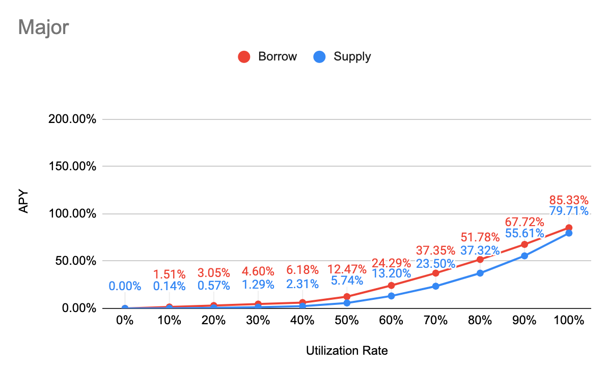
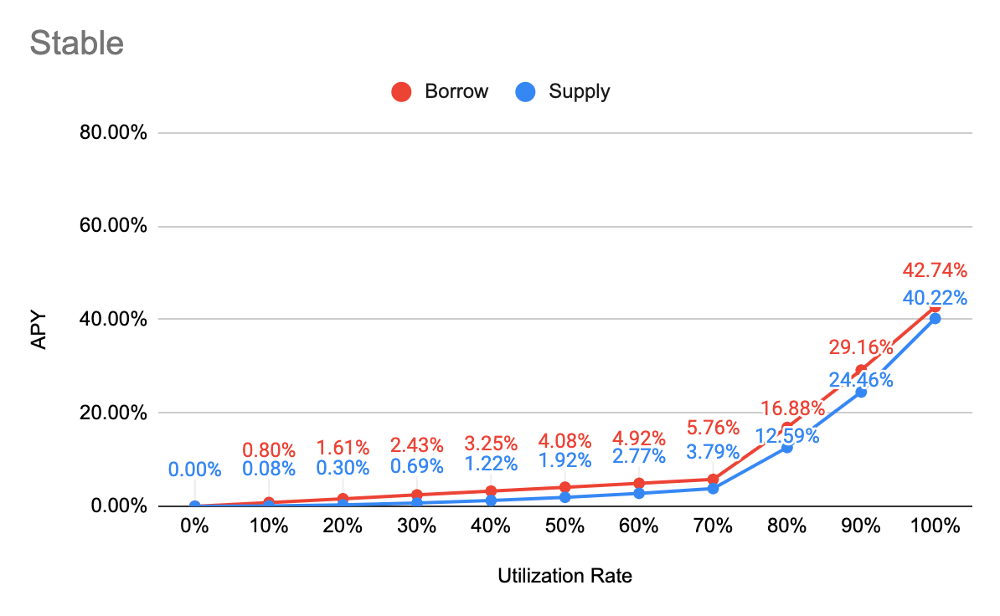

# Interest Rate Model

## APY Function

Borrow APY

= Base + min\(Multiplier \* __UtilizationRate, Multiplier \* Kink\) + max\(JumpMultiplier \* UtilizationRate - Kink, 0\)

Supply APY

= annualized\[de–annualized\(Borrow APY\) - Reserve Factor\]

## Major

| Parameter | Value |
| :--- | :--- |
| Category | Major |
| Tokens | WFTM, ETH, BTC |
| Base | 0% |
| Multiplier | 15% |
| JumpMultiplier | 100% |
| Kink | 45% |
| Contract Address | [0x5Dc3A30d8c5937f1529C3c93507C16d86A17072A](https://ftmscan.com/address/0x5Dc3A30d8c5937f1529C3c93507C16d86A17072A#readContract) |

## Stable

| Parameter | Value |
| :--- | :--- |
| Category | Stable |
| Tokens | USDC, DAI, sUSD, FRAX |
| Base | 0% |
| Multiplier | 8% |
| JumpMultiplier | 100% |
| Kink | 70% |
| Contract Address | [0x9bF8757D33e20713d3fA61c889C892B00f3b3B6E](https://ftmscan.com/address/0x9bf8757d33e20713d3fa61c889c892b00f3b3b6e#readContract) |

## Governance

| Parameter | Value |
| :--- | :--- |
| Category | Governance |
| Tokens | CREAM, YFI, SUSHI, AAVE, CRV, BAND, KP3R, COVER, HEGIC, LINK, SNX, SFI |
| Base | 0% |
| Multiplier | 10% |
| JumpMultiplier | 320% |
| Kink | 45% |
| Contract Address | [0xd5794ea7b269dB3a0CCB396774Cc2D0936FFBD86](https://ftmscan.com/address/0xd5794ea7b269dB3a0CCB396774Cc2D0936FFBD86#readContract) |

