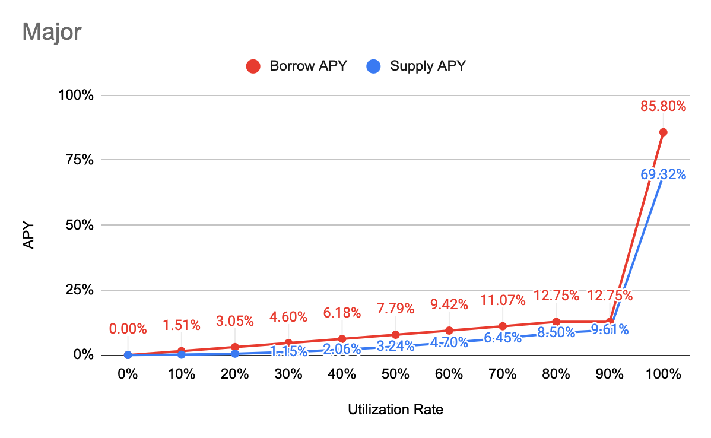
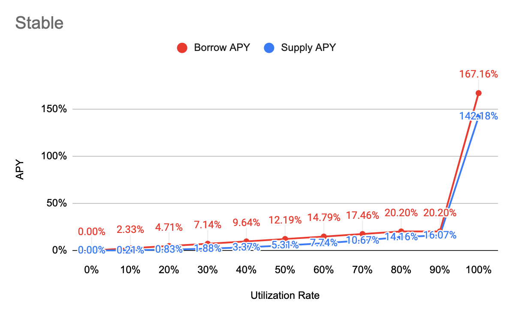
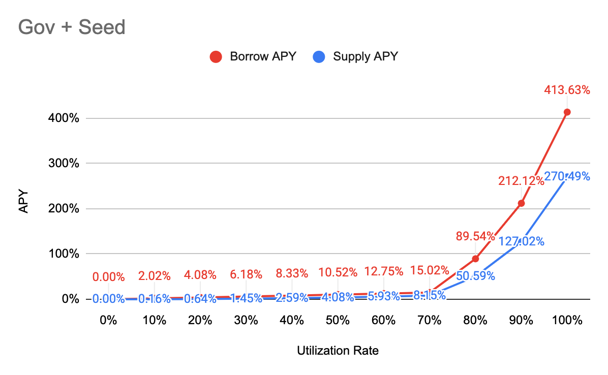

# Interest Rate Model

## APY Function

**Borrow APY**

= \[1 + Base + Multiplier \* min\(UtilizationRate, Kink\) + max\(JumpMultiplier \* UtilizationRate - Kink, 0\)\] ^ 2102400 - 1

**Supply APY**

= Distribute \(Interest Paid by Borrowers Per Block - Reserve\) to all suppliers, and convert it into APY

= Distribute \[\(1 + Borrow APY\) ^ \(1 / BlocksPerYear\) - 1\] \* Total Borrow \* \(1 - Reserve Factor\) to all suppliers, and convert it into APY

= {\[\(1 + Borrow APY\) ^ \(1 / BlocksPerYear\) - 1\] \* Total Borrow \* \(1 - Reserve Factor\) / Total Supply}, and convert it into APY

= {1 + \[\(1 + Borrow APY\) ^ \(1 / BlocksPerYear\) - 1\] \* Total Borrow \* \(1 - Reserve Factor\) / Total Supply} ^ BlocksPerYear - 1

= **{1+\[\(1+Borrow APY\)^\(1/BlocksPerYear\)-1\]\*\(1-Reserve Factor\)\*Utilization Rate}^BlocksPerYear-1**


BlocksPerYear = 15,768,000 \(2 sec per block\)



Find other variables in [Markets](https://app.cream.finance/markets)


## Major

| Parameter | Value |
| :--- | :--- |
| Category | Major |
| Tokens | MATIC, WETH, WBTC |
| Base | 0% |
| Multiplier | 15% |
| JumpMultiplier | 500% |
| Kink 1 | 80% |
| Kink 2 | 90% |
| Contract Address | [0xB1FD648D8CA4bE22445963554b85AbbFC210BC83](https://polygonscan.com/address/0xB1FD648D8CA4bE22445963554b85AbbFC210BC83) |

## Stable

| Parameter | Value |
| :--- | :--- |
| Category | Stable |
| Tokens | USDT, USDC, DAI |
| Base | 0% |
| Multiplier | 23% |
| JumpMultiplier | 800% |
| Kink 1 | 80% |
| Kink 2 | 90% |
| Contract Address | [0x379555965fcdbA7A40e8B5b5eF4786f51ADeeF31](https://polygonscan.com/address/0x379555965fcdbA7A40e8B5b5eF4786f51ADeeF31) |

## Governance

| Parameter | Value |
| :--- | :--- |
| Category | Governance |
| Tokens | LINK, SUSHI |
| Base | 0% |
| Multiplier | 20% |
| JumpMultiplier | 500% |
| Kink 1 | 70% |
| Kink 2 | 80% |
| Contract Address | [0x06288754f31d100039b21e62a429e4B81E56B626](https://polygonscan.com/address/0x06288754f31d100039b21e62a429e4B81E56B626) |

