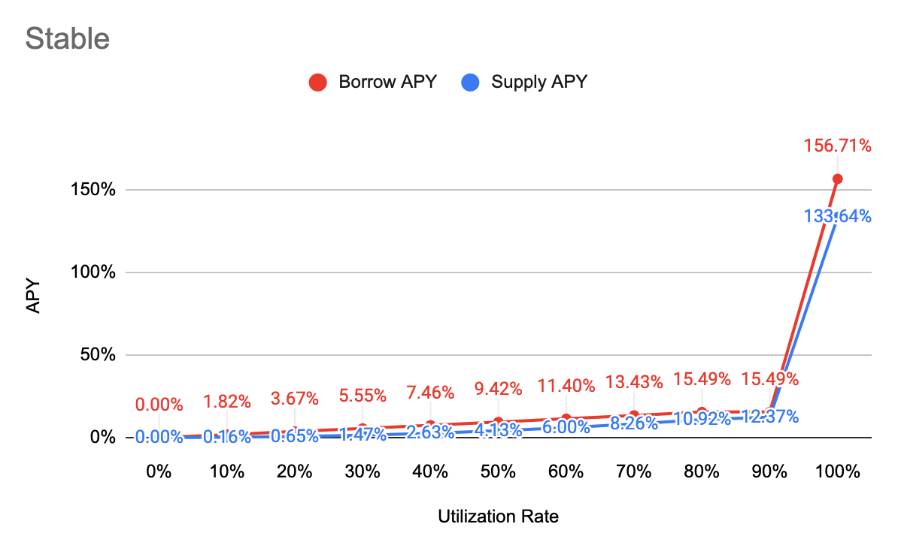
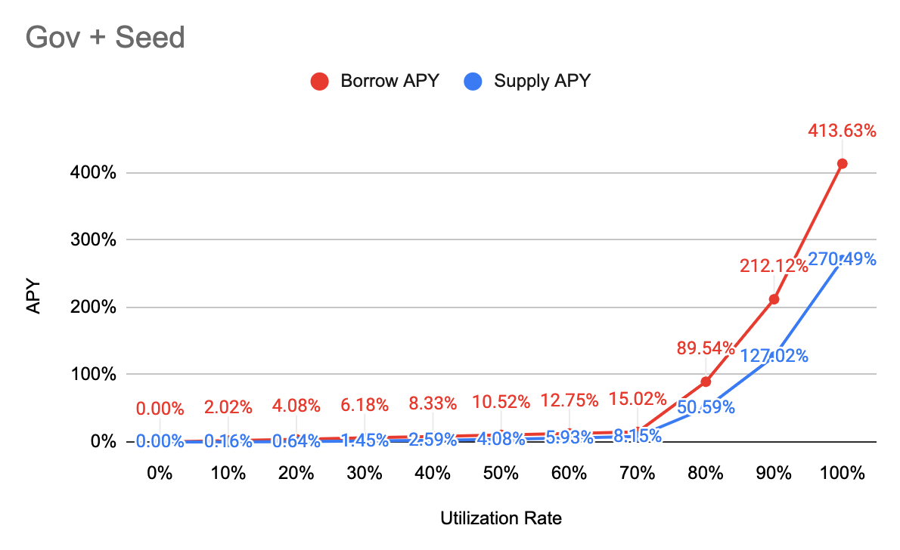
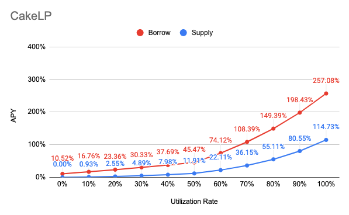
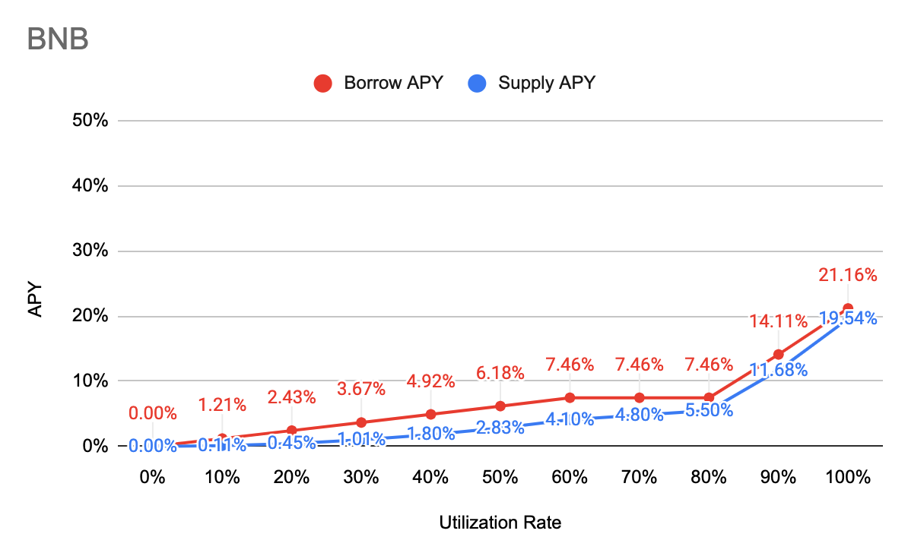

# Interest Rate Model

## APY Function

**Borrow APY**

= \[1 + Base + Multiplier \* min\(UtilizationRate, Kink\) + max\(JumpMultiplier \* UtilizationRate - Kink, 0\)\] ^ 10512000 - 1

**Supply APY**

= Distribute \(Interest Paid by Borrowers Per Block - Reserve\) to all suppliers, and convert it into APY

= Distribute \[\(1 + Borrow APY\) ^ \(1 / BlocksPerYear\) - 1\] \* Total Borrow \* \(1 - Reserve Factor\) to all suppliers, and convert it into APY

= {\[\(1 + Borrow APY\) ^ \(1 / BlocksPerYear\) - 1\] \* Total Borrow \* \(1 - Reserve Factor\) / Total Supply}, and convert it into APY

= {1 + \[\(1 + Borrow APY\) ^ \(1/BlocksPerYear\) - 1\] \* Total Borrow \* \(1 - Reserve Factor\) / Total Supply} ^ BlocksPerYear - 1

= **{1+\[\(1+Borrow APY\)^\(1/BlocksPerYear\)-1\]\*\(1-Reserve Factor\)\*Utilization Rate}^BlocksPerYear-1**


BlocksPerYear = 10,512,000 \(3 sec per block\)



Find other variables in [Markets](https://app.cream.finance/markets)


## Major

| Parameter | Value |
| :--- | :--- |
| Category | Major |
| Tokens | BTCB, XRP, LTC, BCH, ETH, ADA, EOS, XTZ, renBTC, renZEC, BETH, WBNB |
| Base | 0% |
| Multiplier | 15% |
| JumpMultiplier | 200% |
| Kink 1 | 80% |
| Kink 2 | 90% |
| Contract Address | [0xd68F6C83E160d86bF1fC0120a0D96A74cF291Bff](https://bscscan.com/address/0xd68F6C83E160d86bF1fC0120a0D96A74cF291Bff) |

## Stable

| Parameter | Value |
| :--- | :--- |
| Category | Stable |
| Tokens | BUSD, USDT, DAI, USDC, VAI |
| Base | 0% |
| Multiplier | 18% |
| JumpMultiplier | 800% |
| Kink 1 | 80% |
| Kink 2 | 90% |
| Contract Address | [0x8122E8585724BFd0A5964847fAe47c949B90B899](https://bscscan.com/address/0x8122E8585724BFd0A5964847fAe47c949B90B899) |

## Governance + Seed

| Parameter | Value |
| :--- | :--- |
| Category | Governance & Seeds |
| Tokens | DOT, LINK, CREAM, BAND, FIL, YFI, UNI, ATOM, ALPHA, TWT, CAKE, XVS, BAT, AUTO, IOTX, SXP, SUSHI |
| Base | 0% |
| Multiplier | 20% |
| JumpMultiplier | 500% |
| Kink 1 | 70% |
| Kink 2 | 80% |
| Contract Address | [0xEb689084bD7990604Eef53376D269f87CB12cA63](https://bscscan.com/address/0xEb689084bD7990604Eef53376D269f87CB12cA63) |

## Cake Liquidity Provider token \(CakeLP\)

<table>
  <thead>
    <tr>
      <th style="text-align:left">Parameter</th>
      <th style="text-align:left">Value</th>
    </tr>
  </thead>
  <tbody>
    <tr>
      <td style="text-align:left">Category</td>
      <td style="text-align:left">CakeLP</td>
    </tr>
    <tr>
      <td style="text-align:left">Tokens</td>
      <td style="text-align:left">
        
CAKE-LP-CAKE-BNB v2

        
CAKE-LP-BNB-BUSD v2

        
CAKE-LP-BTCB-BNB v2

        
CAKE-LP-ETH-BNB v2

        
CAKE-LP-USDT-BUSD v2

      </td>
    </tr>
    <tr>
      <td style="text-align:left">Base</td>
      <td style="text-align:left">10%</td>
    </tr>
    <tr>
      <td style="text-align:left">Multiplier</td>
      <td style="text-align:left">55%</td>
    </tr>
    <tr>
      <td style="text-align:left">JumpMultiplier</td>
      <td style="text-align:left">180%</td>
    </tr>
    <tr>
      <td style="text-align:left">Kink</td>
      <td style="text-align:left">50%</td>
    </tr>
    <tr>
      <td style="text-align:left">Contract Address</td>
      <td style="text-align:left"><a href="https://bscscan.com/address/0x0A4F9Ab20A56DD4624266c610B5F960Bd72C5710">0x0A4F9Ab20A56DD4624266c610B5F960Bd72C5710</a>
      </td>
    </tr>
  </tbody>
</table>

### BNB

| Parameter | Value |
| :--- | :--- |
| Category | BNB |
| Tokens | BNB |
| Base | 0% |
| Multiplier | 12% |
| JumpMultiplier | 60% |
| Kink 1 | 60% |
| Kink 2 | 80% |
| Contract Address | [0x5F18B46FFb6dfC1A4a2c2fDbC4De48dc741C7EF4](https://bscscan.com/address/0x5F18B46FFb6dfC1A4a2c2fDbC4De48dc741C7EF4) |

