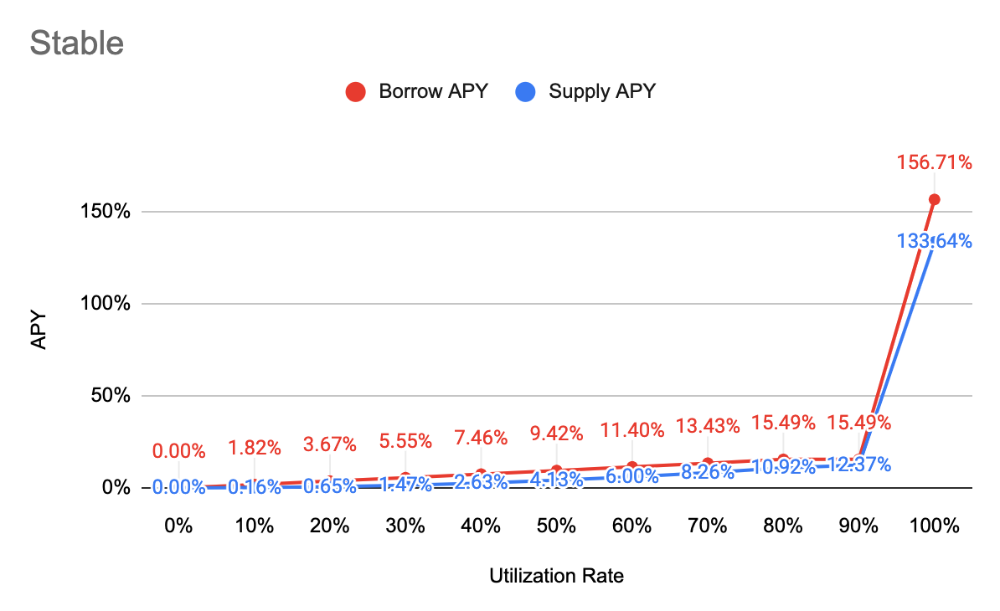

# Interest Rate Model

## APY Function

**Borrow APY**

= Base + Multiplier \* min\(UtilizationRate, Kink\) + max\(JumpMultiplier \* UtilizationRate - Kink, 0\)

**Supply APY**

= Distribute \(Interest Paid by Borrowers Per Block - Reserve\) to all suppliers, and convert it into APY

= Distribute \[\(1 + Borrow APY\) ^ \(1 / BlocksPerYear\) - 1\] \* Total Borrow \* \(1 - Reserve Factor\) to all suppliers, and convert it into APY

= {\[\(1 + Borrow APY\) ^ \(1 / BlocksPerYear\) - 1\] \* Total Borrow \* \(1 - Reserve Factor\) / Total Supply}, and convert it into APY

= {1 + \[\(1 + Borrow APY\) ^ \(1/BlocksPerYear\) - 1\] \* Total Borrow \* \(1 - Reserve Factor\) / Total Supply} ^ BlocksPerYear - 1

= **{1+\[\(1+Borrow APY\)^\(1/BlocksPerYear\)-1\]\*\(1-Reserve Factor\)\*Utilization Rate}^BlocksPerYear-1**


BlocksPerYear = 31,536,000 \(1 sec per block\)



Find other variables in [Markets](https://app.cream.finance/markets)


## Major

| Parameter | Value |
| :--- | :--- |
| Category | Major |
| Tokens | WFTM, ETH, BTC |
| Base | 0% |
| Multiplier | 15% |
| JumpMultiplier | 200% |
| Kink 1 | 80% |
| Kink 2 | 90% |
| Contract Address | [0x338EEE1F7B89CE6272f302bDC4b952C13b221f1d](https://ftmscan.com/address/0x338EEE1F7B89CE6272f302bDC4b952C13b221f1d) |

## Stable

| Parameter | Value |
| :--- | :--- |
| Category | Stable |
| Tokens | USDC, DAI, sUSD, FRAX |
| Base | 0% |
| Multiplier | 18% |
| JumpMultiplier | 800% |
| Kink 1 | 80% |
| Kink 2 | 90% |
| Contract Address | [0x03445c9002567a33173Cbd2DdC2E0816BdD2b69C](https://ftmscan.com/address/0x03445c9002567a33173Cbd2DdC2E0816BdD2b69C) |

## Governance

| Parameter | Value |
| :--- | :--- |
| Category | Governance |
| Tokens | CREAM, YFI, SUSHI, AAVE, CRV, BAND, KP3R, COVER, HEGIC, LINK, SNX, SFI |
| Base | 0% |
| Multiplier | 20% |
| JumpMultiplier | 500% |
| Kink 1 | 70% |
| Kink 2 | 80% |
| Contract Address | [0x7d26577903F3986D3F3C554B2e229D36fa3f8ea9](https://ftmscan.com/address/0x7d26577903F3986D3F3C554B2e229D36fa3f8ea9) |

